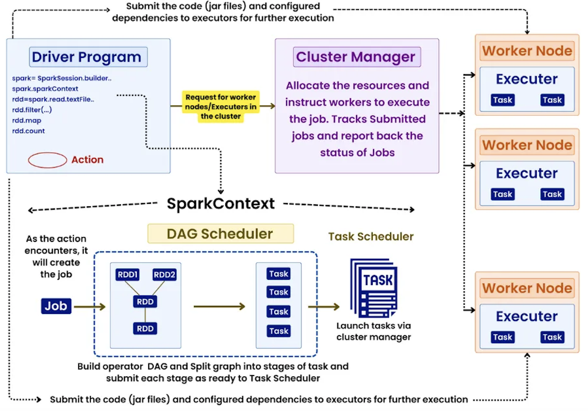
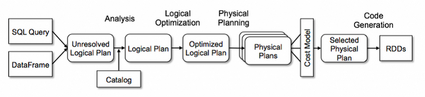

## Spark




### Query plan  builder



## Spark connect 
Traditionally, the Spark driver process must perform a significant amount of work, ranging from running the client application to scheduling the actual data processing. In client mode, users must maintain the full Spark dependencies and ensure they are compatible with those running on the submit destination.

Spark Connect offers a decoupled client-server architecture for Spark by separating the driver process from the client and making the client thinner. There will be a dedicated server that hosts a long-running Spark application (Spark cluster) and exposes a gRPC endpoint to accept client requests. The ultimate goal is to make the client far thinner compared to the traditional approach.
<https://habr.com/ru/companies/arenadata/articles/921246/>

<https://blog.dataengineerthings.org/is-this-feature-a-revolution-in-spark-29636b690ea7>

### Reading files
```
spark.conf.set("spark.sql.files.maxPartitionBytes", "256000000")  # 256 mb  
df = spark.read.parquet("data/").coalesce(10) 
```
### Writing files

sort before writing:
-  by column which is used as a filter during reading and  
-  by column used in join column 

df.sort("date", "user_id").write.parquet("sorted_data/")  
df.sortWithinPartitions("timestamp").write.partitionBy("date").parquet("data/")

OPTIMIZE delta.`/path/table` ZORDER BY (date, user_id);


### 🔹 Partitioning
 
Partitioning is the process of dividing data into **directories** based on column values.

**Key Characteristics**:

-   Implemented at the **directory level**.
    
-   Each unique value (or combination) of the partition column(s) creates a **separate folder**.
    
-   Commonly used in **DataFrame write operations** with `.partitionBy()`.
    

**Example**:

`df.write.partitionBy("country").parquet("/path/to/output")`

This creates a structure like:

`/path/to/output/country=US/... /path/to/output/country=IN/...`

**Benefits**:

-   Efficient **data skipping** during reads (e.g., filters on partition columns).
    
-   Reduces the amount of data scanned during queries.
    

**Trade-offs**:

-   Too many unique values can lead to **too many small files** (small file problem).
    
-   Works best when filtering on the **partition columns**.
    

* * *

### 🔹 Bucketing
 
Bucketing (or **bucketing with sorting**) divides data into a fixed number of **files (buckets)** based on a hash of a column value.

**Key Characteristics**:

-   Implemented at the **file level**, not the directory level.
    
-   Each bucket gets a file like `part-00000`, `part-00001`, etc.
    
-   Defined using `.bucketBy(numBuckets, column)` and used with `saveAsTable()`.
    

**Example**:

`df.write.bucketBy(8, "user_id").sortBy("user_id").saveAsTable("bucketed_users")`

**Benefits**:

-   Optimizes **joins** and **groupBy** operations when both datasets are bucketed on the same column.
    
-   Reduces shuffle during joins if bucketing and number of buckets are aligned.
    
-   Works even when not filtering on the bucketed column.
    

**Trade-offs**:

-   Requires writing to a **Hive-compatible table** (e.g., `.saveAsTable()`).
    
-   Not dynamically adjusted — you must choose the number of buckets in advance.


| Feature        | Partitioning                     | Bucketing                                   |
| -------------- | -------------------------------- | ------------------------------------------- |
| Level          | Directory                        | File                                        |
| Based On       | Column values                    | Hash of column values                       |
| Output Layout  | Folders per partition value      | Fixed number of files per table             |
| Use Cases      | Data skipping during filtering   | Optimized joins and aggregations            |
| Requires Hive? | No                               | Yes (for full support, e.g., `saveAsTable`) |
| Flexibility    | Dynamic (based on column values) | Static (number of buckets fixed)            |


#### block size tuning:

Parquet  
``` 
df.write.option("parquet.block.size", 256 * 1024 * 1024).parquet("output/")
```
ORC  
```
df.write.option("orc.stripe.size", 256 * 1024 * 1024).orc("output/")
```
CSV/Avro  
```
df.repartition(100).write.csv("output/")
```
####  for partitioned tables
df.sortWithinPartitions("user_id").write.partitionBy("date").parquet("partitioned_data/")

<https://habr.com/ru/articles/896492/>

### Joins
https://www.canadiandataguy.com/p/spark-join-strategies
https://www.linkedin.com/pulse/spark-join-strategies-mastering-joins-apache-venkatesh-nandikolla-mk4qc/
https://www.sparkcodehub.com/spark-dataframe-multiple-join#google_vignette
https://www.mdpi.com/2076-3417/13/10/6257

- Broadcast Hash Join
- Shuffle Hash Join
- Sort Merge Join (default)
- Cartesian Join
- Broadcast Nested Loop Join


https://www.linkedin.com/pulse/spark-join-strategies-mastering-joins-apache-venkatesh-nandikolla-mk4qc/
```
🔹🔹Broadcast Join🔹🔹
Best For: When one DataFrame is small enough to fit in memory.
How It Works: The smaller DataFrame is broadcasted to all nodes in the cluster, allowing the join to be performed locally on each partition.
✅Pros: Reduces network shuffling, leading to faster execution times.
❌Cons: Limited by the size of the smaller DataFrame; memory-intensive if not managed properly.

🔹🔹Sort-Merge Join🔹🔹
Best For: Large datasets that are already sorted or can be efficiently sorted by the join key.
How It Works: Spark sorts the data in each partition by the join key and then merges the partitions.
✅Pros: Efficient for large datasets and multi-column joins.
❌Cons: Requires sorting, which can be computationally expensive; may require more memory.

🔹🔹Shuffle Hash Join🔹🔹
Best For: General-purpose join when neither broadcast nor sort-merge is feasible.
How It Works: Data is shuffled across nodes based on the join key, and a hash table is used to perform the join.
✅Pros: Works well with large, unsorted datasets.
❌Cons: High network I/O due to shuffling; slower than the other join strategies.

🔹🔹Which One Should You Use?🔹🔹
Small DataFrame? Go for Broadcast Join.
Large, Pre-Sorted DataFrames? Sort-Merge Join is your friend.
Unsorted, Massive Data? Use Shuffle Hash Join, but be mindful of its performance impact.
```

### repartition method

#### case 1
df.repartition(numPartitions)
Partitions data randomly into the given number of partitions.  
Triggers a full shuffle.  
No column used for partitioning.

#### case 2
df.repartition(col1, col2, ..., colN)

Partitions data based on the values of the given column(s) using hash partitioning.  
The number of partitions is determined by Spark's default parallelism or by cluster settings.

```python
df = df.repartition("user_id")  # Partition by user_id values
```
#### case 3 
```python
df.repartition(numPartitions, col1, col2, ..., colN)
```
Explicitly set the number of partitions and partition by the given column(s).

```python
df = df.repartition(20, "country", "city")  # 20 partitions by country & city
```

| Use Case                            | Recommended API              |
| ----------------------------------- | ---------------------------- |
| Increase partitions evenly          | `repartition(n)`             |
| Balance skew before join            | `repartition(col)`           |
| Partition by multiple fields        | `repartition(n, col1, col2)` |
| Reduce partitions (without shuffle) | `coalesce(n)`                |


### Join: Repartitioning on Join Key

```python
df_1 = df_1.repartition("customer_id")
df_2 = df_2.repartition("viewer_id")
joined_table = df_1.join(
               df_2, df_1.customer_id == df_2.viewer_id, "inner"
               )

df1 = large_df.repartition(100, “join_key”)
df2 = small_df.repartition(100, “join_key”)
joined_df = df1.join(df2, “join_key”, “left”)
```

### Broadcast small DataFrames
```python
from pyspark.sql.functions import broadcast
joined_df = larger_df.join(broadcast(smaller_df), ["identifier"], "left")

small_df = spark.read.csv(“small_data.csv”)
large_df = spark.read.csv(“large_data.csv”)

joined_df = large_df.join(broadcast(small_df), “key”)
```

### Avoiding Wide Transformations

Wide transformations (e.g., groupBy, distinct, orderBy) can increase the shuffle cost significantly. It’s best to avoid wide transformations before the join, or to apply filters and narrow transformations to reduce the dataset size beforehand.

Filter the DataFrame before join to reduce data size
```python
filtered_large_df = large_df.filter(large_df.column > 100)

joined_df = filtered_large_df.join(small_df, “join_key”, “left”)
```
Always filter and select the necessary columns before performing a join to minimize data movement.


### mapPartitions
Unlike map or flatMap, which invoke a function for each element, mapPartitions incurs only one function invocation per partition, significantly reducing overhead—especially for large datasets.


### Salting: solution for sqewed data in join

Problem statement:  
The 7 records out of 10 in the first table has the value 1  
It means all of them goes to same executor   
in following code:
```python
df_1 = spark.read.load("abc").select("id","col_a","col_b" )  #15GB
df_2 = spark.read.load("xyz").select("id","col_c") #6GB

df_join = df_1.join(df_2, "id","inner")
df_join.write.parquet(path)
```

Salting:

- Step 1: We choose a salt number range (0 to X) — let’s call this salt_num

- Step 2: To big dataset, we add a column called id_salted which will be  
CONCAT(id, ‘_’, random(0,salt_number-1))

- Step 3: Explode the smaller of the 2 datasets to contain all combination of records from salt number 0 to X.   
So, this table will have ( N * salt_num ) number of records post explosion.

- Step 4: Join on this new “id_salted”


```python
import pyspark.sql.functions as F
salt_num = 4

#Let's add salt to df_1 - Big Table
df_1_salted_tmp = df_1.withColumn("salt", F.floor(F.rand()*salt_num).cast('int'))
df_1_salted = df_1_salted_tmp.withColumn("id_salted", F.concat(F.col('id'),F.lit('_'),F.col('salt'))).drop('salt')

##Let's add salt to df_2 - Small Table
df_salt_range = spark.range(salt_num).toDF("salt")   ## Create a DF with 4 records from 0 to 3 since our salt_num=3
df_2_salted_tmp = df_2.crossJoin(df_salt_range)   ## CROSS JOIN with small table
df_2_salted = df_2_salted_tmp.withColumn("id_salted", F.concat(F.col('id'),F.lit('_'),F.col('salt'))).drop('salt')

## Join on id_salted column

df_join =df_1_salted.join(df_2_salted, "id_salted").drop("id_salted")
df_join.write.parquet(path)

```

 Avoid using count() Action
```python
df = sqlContext.read().json(...);
if not len(df.take(1)):   # <-- use this  instead of: if not df.count():
```

### Bucketing:

Bucketing helps improve join performance by reducing shuffle. When you bucket a DataFrame, 
Spark saves it in pre-shuffled form, allowing future joins on the same key to avoid a shuffle.

Bucketing the DataFrames on join_key
```python
df1.write.bucketBy(100, “join_key”).saveAsTable(“bucketed_df1”)
df2.write.bucketBy(100, “join_key”).saveAsTable(“bucketed_df2”)

# Now the join will not require a shuffle

bucketed_df1 = spark.table(“bucketed_df1”)
bucketed_df2 = spark.table(“bucketed_df2”)
joined_df = bucketed_df1.join(bucketed_df2, “join_key”, “left”)
```
When to use Bucketing:

You frequently perform joins on the same key across the same datasets.
Your datasets are huge, and you want to avoid the shuffling cost.

Without bucketing:

```python

df1 = spark.table('table1')
df2 = spark.table('table2')

# Print the Physical plan of this join and join strategy by Spark
df1.join(df2, 'joining_key').explain()
```
Above code will shuffle i.e exchange the data as it is not bucketed.  
SortMergeJoin is the default Spark join,  
but now let’s avoid the data exchanges that happened by using bucketing:   
```python
df.write\
    .bucketBy(32, 'joining_key') \
    .sortBy('date_created') \
    .saveAsTable('bucketed', format='parquet')
```
bucketBy() distributes data into a predetermined number of partitions,  
providing a scalable solution when the cardinality of unique values is high.  

However, for datasets with a limited number of distinct values,
partitioning is often a more efficient approach.
 


#### ReduceByKey over GroupByKey: 
Use reduceByKey instead of groupByKey to minimize the amount of data shuffled.


#### Spark Config
```
spark.executor.memory  
spark.executor.cores    
spark.sql.files.maxPartitionBytes: This parameter controls the size of each partition.

spark.conf.set(“spark.sql.adaptive.enabled”, “true”)  Enable AQE
spark.conf.set(“spark.sql.adaptive.enabled”, “true”)      Skew Join Optimization
spark.conf.set(“spark.sql.adaptive.skewJoin.enabled”, “true”) Skew Join Optimization
```


### Here are some of the main Spark configuration parameters that  impact performance:

#### 1. Resource Allocation
- spark.executor.instances: This controls the number of executors to launch for an application. More executors generally mean more parallelism, but also more overhead. Tune this based on the cluster size and application needs.
- spark.executor.cores: This sets the number of cores each executor can use. More cores per executor can improve parallelism within each executor but can also lead to more competition for memory.
- spark.executor.memory: This defines the amount of memory allocated to each executor. Sufficient memory is crucial to avoid disk spills during shuffles and for caching data.

- spark.driver.memory: This sets the memory allocated to the driver process. Increase this if the driver is handling large amounts of data or complex operations.
- spark.cores.max: In standalone and YARN modes, this limits the total number of cores the application can request.

Tuning Strategy: Experiment with different combinations of executors, cores, and memory based on your workload and cluster resources. Monitor resource utilization in the Spark UI. A common starting point is 2-3 cores per executor.

#### 2. Parallelism and Partitioning
- spark.default.parallelism: This sets the default number of partitions for RDDs created from sources like files. A good rule of thumb is to have 2-3 tasks per CPU core in your cluster.
- spark.sql.shuffle.partitions: This controls the number of partitions used when shuffling data for operations like joins and aggregations in Spark SQL. Increasing this can improve parallelism after a shuffle but can also increase overhead.

Partitioning of Input Data: The number and size of input partitions directly affect parallelism. Ensure your data is partitioned appropriately based on the cluster size. Consider repartitioning or coalescing RDDs/DataFrames.

Tuning Strategy: Aim for a number of partitions that allows for parallel processing without overwhelming the cluster. Partition sizes of around 100-200MB are often recommended.


Apache Spark offers several data partitioning strategies to control how data is distributed across the cluster, which is critical for performance and scalability.

Below are the main data partitioning strategies in Spark, including both built-in mechanisms and user-defined options:

🔹 1. Default Hash Partitioning
How it works: Spark uses a hash function on the key (for key-value data) to distribute records across partitions.

When used: Automatically applied when using operations like groupByKey, reduceByKey, join, etc.

Example:

```python
rdd = sc.parallelize([("a", 1), ("b", 2), ("a", 3)])
rdd.partitionBy(4)  # partitions using hash of keys
```
🔹 2. Range Partitioning
How it works: Records are partitioned based on a range of values, often for ordered data.

When used: Useful for queries involving range filters or sorting.

Example:

```python
df = spark.range(0, 1000)
df = df.repartitionByRange(5, "id")
```
🔹 3. Custom Partitioning (User-Defined Partitioners)
How it works: You define your own partitioning logic by extending org.apache.spark.Partitioner.

When used: Rarely needed unless you have highly specific distribution requirements.

Example (Scala):

```scala
class MyPartitioner(partitions: Int) extends Partitioner {
  def numPartitions = partitions
  def getPartition(key: Any): Int = {
    key.toString.length % partitions
  }
}
```
🔹 4. Coalescing
How it works: Reduces the number of partitions (e.g., after filtering large data).

When used: To avoid overhead of too many small partitions before output.

Example:

```python
df.coalesce(1)  # reduces to 1 partition, no shuffle
```
🔹 5. Repartitioning
How it works: Increases or decreases the number of partitions, with a shuffle.

When used: When data is heavily skewed or improperly partitioned.

Example:

```python
df.repartition(10)  # redistributes data with full shuffle
```
🔹 6. Bucketing (for Spark SQL / DataFrames)
How it works: In Spark SQL, you can bucket data by column for performance on joins.

When used: Requires writing data using bucketBy, used during table creation.

Example:

```python
df.write.bucketBy(4, "user_id").sortBy("timestamp").saveAsTable("events")
```
🔹 7. Skewed Data Handling (Salting)
How it works: A manual strategy to avoid skew by adding randomness to keys (salting).

When used: For extreme data skew (e.g., one key has 90% of the data).

Example:

```python
df = df.withColumn("salted_key", concat(col("key"), lit("_"), rand()))
```
⚙️ How to Check Current Partitions
```python
rdd.getNumPartitions()
df.rdd.getNumPartitions()
```
🧠 Best Practices
Use repartitionByRange() for range-based queries.

Avoid unnecessary repartitioning—it triggers a full shuffle.

Use coalesce() over repartition() if you're only reducing partitions.

Monitor skew using Spark UI → Stages → Tasks.


#### 3. Memory Management
spark.memory.fraction: This parameter determines the fraction of JVM heap space used for Spark execution and storage. The rest is reserved for user code and metadata.
spark.memory.storageFraction: Within the Spark memory fraction, this determines the fraction used for caching (storage). Execution memory can borrow from storage if needed.

- spark.shuffle.memoryFraction: This fraction of the execution memory is used for in-memory shuffle buffers. Increasing this can reduce disk spills during shuffles.
- spark.storage.level: This controls how RDDs/DataFrames are cached (e.g., memory-only, memory-and-disk, with or without serialization). Choose the level based on data access patterns and memory availability.
- spark.sql.cache.compressed: When set to true, Spark SQL will store cached tables in a compressed format to reduce memory usage.
Tuning Strategy: Monitor memory usage in the Spark UI. If you see excessive disk spills, consider increasing executor memory or adjusting memory fractions. Choose the appropriate storage level for caching based on how frequently the data is accessed.

#### 4. Shuffle Performance
- spark.shuffle.file.buffer: Size of the in-memory buffer for each shuffle file output stream (in KB). Increasing this can reduce disk I/O during shuffles.
- spark.shuffle.spill.compress: Whether to compress data spilled to disk during shuffles. Compression can save disk space but adds CPU overhead.

- spark.shuffle.sort.bypassMergeThreshold: For shuffles with fewer than this many reduce tasks,
Spark can use a memory-efficient but potentially less performant code path that avoids sorting.
  
Tuning Strategy: Monitor shuffle read and write times in the Spark UI. Experiment with buffer sizes and compression based on your workload and disk I/O characteristics.

#### 5. Data Serialization
- spark.serializer: This specifies the serialization library to use (e.g., org.apache.spark.serializer.JavaSerializer or org.apache.spark.serializer.KryoSerializer). Kryo is often more efficient and faster than Java serialization.
- spark.kryo.registrator: If using Kryo, you can register your custom classes for more efficient serialization.
- spark.kryoserializer.buffer.max: Maximum buffer size used by Kryo (in MB). Increase this if you encounter "buffer overflow" exceptions during serialization.

Tuning Strategy: Generally, using Kryo serialization is recommended for better performance and reduced memory usage. Register your custom classes with Kryo for optimal efficiency.

### 6. Garbage Collection (GC)
spark.executor.extraJavaOptions: Allows you to set JVM options for executors, including GC settings (e.g., -XX:+UseG1GC).
spark.driver.extraJavaOptions: Allows you to set JVM options for the driver.
Tuning Strategy: Monitor GC activity in the Spark UI. If you see long GC pauses, experiment with different GC algorithms (like G1 GC) and adjust JVM heap sizes.

## 7. Adaptive Query Execution (AQE)

<https://habr.com/ru/companies/gnivc/articles/967656/>

- spark.sql.adaptive.enabled: Enables Adaptive Query Execution, which allows Spark to re-optimize query plans during runtime based on statistics.
- spark.sql.adaptive.coalescePartitions.enabled: Enables coalescing of shuffle output partitions to reduce the number of downstream tasks.
- spark.sql.adaptive.skewJoin.enabled: Enables handling of skew joins by splitting larger partitions into smaller ones.
spark.sql.adaptive.autoBroadcastJoinThreshold: Configures the threshold below which Spark will automatically broadcast a join side.

Tuning Strategy: Enabling AQE is generally recommended as it can automatically improve query performance. Tune the related parameters based on your data characteristics.

#### 8. Data Format
Using efficient columnar formats like Parquet or ORC can significantly improve performance compared to row-based formats like CSV or JSON, especially for analytical workloads. These formats allow for predicate pushdown and efficient column pruning.
Tuning Strategy: Store your data in columnar formats whenever possible.

#### 9. Avoiding Unnecessary Operations
Minimize Shuffles: Operations like groupByKey, reduceByKey, and joins can trigger shuffles, which are expensive.  
Try to use more efficient alternatives like reduceByKey instead of groupByKey followed by a reduce operation, or use broadcast joins for smaller datasets.
Avoid Collecting Large Datasets to the Driver:   
Operations like collect() can bring the entire dataset to the driver's memory, which can cause out-of-memory errors.
Use Built-in Functions: Spark's built-in functions are often more optimized than User-Defined Functions (UDFs), especially those written in Python.  
If you must use UDFs, consider using Pandas UDFs (vectorized UDFs) for better performance.

Monitoring is Key:

The most crucial aspect of performance tuning is monitoring your Spark application's execution using the Spark UI.  
This will provide insights into resource utilization, task durations, shuffle sizes, memory usage, and garbage collection activity, helping you identify bottlenecks and the impact of your configuration changes.

Remember that the optimal configuration parameters depend heavily on your specific workload, data size, cluster configuration, and the nature of your Spark applications. It often involves experimentation and iterative tuning.


## Apache Spark 4.0
 
https://medium.com/@goyalarchana17/whats-next-for-apache-spark-4-0-a-comprehensive-overview-with-comparisons-to-spark-3-x-c2c1ba78aa5b?sk=81039bff1aadd3a8e65507a43f21ec12


### Links

https://medium.com/codebrace/how-spark-runs-a-query-internally-a-step-by-step-guide-c87e0a1937b5

https://medium.com/@krthiak/a-pyspark-interview-questions-day-71-of-100-days-of-data-engineering-ai-and-azure-challenge-f11ef54cd6d0

https://medium.com/@rames1000

https://blog.det.life/pyspark-interview-question-by-walmart-hard-level-57c1110565d1

https://medium.com/@dhanashrisaner.30/advanced-aggregations-and-grouping-in-pyspark-89ee7c9dcd6d


https://blog.det.life/i-spent-4-hours-learning-apache-spark-resource-allocation-08b570d88335

https://blog.det.life/i-spent-6-hours-learning-how-apache-spark-plans-the-execution-for-us-a98756a26602

https://blog.devgenius.io/behind-the-scenes-what-happens-after-you-spark-submit-31439651f6df

https://towardsdatascience.com/feature-engineering-for-time-series-using-pyspark-on-databricks-02b97d62a287

### Spark performance

https://towardsdev.com/spark-beyond-basics-hidden-actions-in-your-spark-code-b2b7c5dff74e

https://medium.com/@kaviprakash.2007/spark-performance-optimization-in-databricks-a-complete-guide-ab57280a8260

https://medium.com/@dev.sharma/pyspark-performance-optimization-techniques-3b9946c9cb4e

https://medium.com/@vtrkayalrajan/spark-optimization-for-a-large-datasets-8a045986660e

https://medium.com/@vinciabhinav7/apache-spark-common-mistakes-14407bebe259

https://www.youtube.com/watch?v=O4MlLUYkjN8

https://rahultiwari876.medium.com/big-data-spark-optimization-techniques-part-1-d485c99ec66f

https://rahultiwari876.medium.com/big-data-spark-optimization-techniques-part-2-da866d6f8243

https://towardsdev.com/spark-beyond-basics-smb-join-in-apache-spark-no-shuffle-join-3c0559105b87


### Caching

https://blog.devgenius.io/spark-cache-persist-checkpoint-write-to-hdfs-0ea63ab4cb07

https://www.youtube.com/watch?v=p6_0qdd6X08

https://www.youtube.com/watch?v=KRAS7R2GWgc

Caching can improve performance when the same data is accessed multiple times.

```
• Choose the right storage level: Use appropriate storage levels (e.g., MEMORY_ONLY, MEMORY_AND_DISK) based on your application’s needs.

# Example of caching a DataFrame
df = spark.read.csv(“data.csv”)
df.cache()
```

### Query execution plan

https://www.youtube.com/watch?v=dCvxE2WSOsE

https://www.databricks.com/blog/2016/05/23/apache-spark-as-a-compiler-joining-a-billion-rows-per-second-on-a-laptop.html

https://premvishnoi.medium.com/exploring-apache-sparks-catalyst-optimizer-and-tungsten-execution-engine-57c51927cf1a

https://towardsdatascience.com/mastering-query-plans-in-spark-3-0-f4c334663aa4

https://medium.com/@deepa.account/spark-logical-and-physical-plan-generation-d0e7d7851d89

https://www.youtube.com/watch?v=UZt_tqx4sII - How to Read Spark Query Plans | Rock the JVM

https://www.youtube.com/watch?v=_Ne27JcLnEc - From Query Plan to Performance: Supercharging your Apache Spark Queries using the Spark UI SQL Tab

https://www.youtube.com/watch?v=rNpzrkB5KQQ  - Understanding the Spark UI

https://www.youtube.com/watch?v=lHJc0rEqjoU Spark UI

#### Explain plan

Official documentation:
https://spark.apache.org/docs/latest/api/python/reference/pyspark.sql/api/pyspark.sql.DataFrame.explain.html#pyspark.sql.DataFrame.explain

```
Spark provides an EXPLAIN() API to look at the Spark execution plan.
You can use this API with different modes like “simple,” “extended,” “codegen,” “cost,” or “formatted” 
to view the optimized logical plan and related statistics.

explain(extended = false  - Displays the physical plan.
explain(extended = true   -  Displays the physical as well as all the logical
explain(mode = "simple") — Displays the physical plan.
explain(mode = "extended") — Displays the physical and logical plans.
explain(mode = "codegen") — Displays the Java code generated for executing the query.
explain(mode = "cost") — Displays the optimized logical plan and related statistics.
explain(mode = "formatted") — Displays the simple physical plan and formatted input/output for the operators involved in details.


Example:
---------
explain codegen
select
    id,
    (id > 1 and id > 2) and (id < 1000 or (id + id) = 12) as test  
from
    range(0, 10000, 1, 32)


|== Physical Plan ==
* Project (2)
+- * Range (1)


(1) Range [codegen id : 1]
Output [1]: [id#36167L]
Arguments: Range (0, 10000, step=1, splits=Some(32))

(2) Project [codegen id : 1]
Output [2]: [id#36167L, (((id#36167L > 1) AND (id#36167L > 2)) AND ((id#36167L < 1000) OR ((id#36167L + id#36167L) = 12))) AS test#36161]
Input [1]: [id#36167L]


Example:
----------
  import contextlib
  import io

  with contextlib.redirect_stdout(io.StringIO()) as stdout:
      df.explain(mode="cost")

  logical_plan = stdout.getvalue().split("\n")
```

https://semyonsinchenko.github.io/ssinchenko/post/estimation-spark-df-size/

https://selectfrom.dev/apache-spark-query-plans-lets-explain-1dbb31989315

https://blog.gbrueckl.at/2024/04/visualizing-spark-execution-plans/

```
scala> sql("select v,count(*) from test_agg group by v").explain
== Physical Plan ==
*(2) HashAggregate(keys=[v#1], functions=[count(1)])
+- Exchange hashpartitioning(v#1, 200), true, [id=#41]
   +- *(1) HashAggregate(keys=[v#1], functions=[partial_count(1)])
      +- *(1) LocalTableScan [v#1]


scala> sql("select v,count(*) from test_agg group by v").explain(true)
== Parsed Logical Plan ==
'Aggregate ['v], ['v, unresolvedalias('count(1), None)]
+- 'UnresolvedRelation [test_agg]

== Analyzed Logical Plan ==
v: boolean, count(1): bigint
Aggregate [v#1], [v#1, count(1) AS count(1)#35L]
+- SubqueryAlias test_agg
   +- Project [k#0, v#1]
      +- SubqueryAlias test_agg
         +- LocalRelation [k#0, v#1]

== Optimized Logical Plan ==
Aggregate [v#1], [v#1, count(1) AS count(1)#35L]
+- LocalRelation [v#1]

== Physical Plan ==
*(2) HashAggregate(keys=[v#1], functions=[count(1)], output=[v#1, count(1)#35L])
+- Exchange hashpartitioning(v#1, 200), true, [id=#58]
   +- *(1) HashAggregate(keys=[v#1], functions=[partial_count(1)], output=[v#1, count#39L])
      +- *(1) LocalTableScan [v#1]


To read this plan, you should go bottom up. Spark reads the input dataset, which is a LocalTableScan in this scenario.
 Next, Spark used a HashAggregate for the aggregate function computation.
The aggregate function is count and the group by key is v. So in the first HashAggregate,
Spark will compute the partial count, denoted by partial_count. For each partition,
Spark will do a partial count operation and then merge the results in the final count.
There is an exchange, a shuffle operation. Spark is doing a hash partitioning for the exchange, and it used 200 as the shuffle partition.
The (1) and (2) are for the wholestage codegen stages. Everything with the same index number is in one stage.
So stage boundaries can be recognized by exchange operations that involve a shuffle.
```

### Explain extended
```
Below is another way to get the execution plan using the explain command, which will give the physical plan information.
If you use explain extended, it will give you the parsed logical plan, analyzed logical plan, optimized logical plan,
and the physical plan information as well.

scala> sql("explain select v,count(*) from test_agg group by v").show(false)
+-------------------
|plan                                                                                                                                                                                                                                    |
+------------------
|== Physical Plan ==
*(2) HashAggregate(keys=[v#1], functions=[count(1)])
+- Exchange hashpartitioning(v#1, 200), true, [id=#121]
   +- *(1) HashAggregate(keys=[v#1], functions=[partial_count(1)])
      +- *(1) LocalTableScan [v#1]

+---------------
 
If you have wholeStage disabled, you will not see the wholeStage codegen stage indexes in the plan.

scala> spark.conf.set("spark.sql.codegen.wholeStage", false)

scala> sql("select v,count(*) from test_agg group by v").explain(true)
== Parsed Logical Plan ==
'Aggregate ['v], ['v, unresolvedalias('count(1), None)]
+- 'UnresolvedRelation [test_agg]

== Analyzed Logical Plan ==
v: boolean, count(1): bigint
Aggregate [v#1], [v#1, count(1) AS count(1)#78L]
+- SubqueryAlias test_agg
   +- Project [k#0, v#1]
      +- SubqueryAlias test_agg
         +- LocalRelation [k#0, v#1]

== Optimized Logical Plan ==
Aggregate [v#1], [v#1, count(1) AS count(1)#78L]
+- LocalRelation [v#1]

== Physical Plan ==
HashAggregate(keys=[v#1], functions=[count(1)], output=[v#1, count(1)#78L])
+- Exchange hashpartitioning(v#1, 200), true, [id=#138]
   +- HashAggregate(keys=[v#1], functions=[partial_count(1)], output=[v#1, count#82L])
      +- LocalTableScan [v#1]
```
https://developer.ibm.com/blogs/how-to-understanddebug-your-spark-application-using-explain/

https://medium.com/@ashwin_kumar_/spark-internal-execution-plan-0d4ad067288a

https://medium.com/@deepa.account/spark-logical-and-physical-plan-generation-d0e7d7851d89

```
Spark 3.0 introduced the new feature of Adaptive Query Execution that enables changes in the Physical plan at runtime of the query on the cluster.
Based on the real-time query execution statistics, a much better plan can be incorporated at runtime.

spark.conf.set("spark.sql.adaptive.enabled", "true")

The feature is disabled by default and can be enabled using the above configuration.
The final effect of the feature can be only seen on Spark UI.
But in the plans generated, it does show that the feature is enabled with final Plan as False AdaptiveSparkPlan isFinalPlan=false
```

### Spark SQL with Parameterized Statements
https://github.com/deepavasanthkumar/spark_tips/blob/main/Spark_SQL_Paremeterized_Demo.ipynb
```
With Spark 3.4 onwards, we can directly query from a pyspark dataframe.
Till then, we have been creating a temporary view to provide SQL.

spark.sql("SELECT max(meantemp) FROM {table}",table=df).show()
spark.sql("SELECT date FROM {table} where meantemp = {maxmeantemp}",table=df, maxmeantemp=38.714285714285715).show()
```


### Partitioning and Bucketing

https://blog.det.life/apache-spark-partitioning-and-bucketing-1790586e8917

https://medium.com/@ashwin_kumar_/spark-partitioning-partition-understanding-2c1705c3b0a0

https://blog.devgenius.io/optimizing-pyspark-data-partitioning-vs-bucketing-45ab380e851a

https://medium.com/@ashwin_kumar_/spark-partitioning-vs-bucketing-partitionby-vs-bucketby-09c98c5b40eb

spark.sql.shuffle.partitions. By default, this parameter is set to 200 partitions.


following code to know the data distribution across partitions within a DataFrame or RDD.
```
rdd_partitions = departments.rdd.glom().collect()
for partition_id in range(len(rdd_partitions)):
  print ("partition_id :",partition_id,
         "departments_present :",set(row.departmentName
               for row in rdd_partitions[partition_id]),"partition_dist_cnt :",len(rdd_partitions[partition_id]))
```

#### Repartitioning by specifying only the Partition Column : 
```
In this case, data distribution across partitions will occur using the Hash partitioning method. 
Data will be distributed across partitions based on the hash values of the 'value' column. 
The number of partitions created will be determined by the configuration parameter:

spark.sql.shuffle.partitions. By default, this parameter is set to 200 partitions.

If AQE is enabled, Spark may not create 200 partitions
(AQE Internally uses Coalesce function to merge the smaller partitions), as this can lead to the generation of many empty partitions,
which is not an optimal scenario.
To follow this the code and its underlying principles,
you can disable AQE during the learning process and enable it again once its done.

# To Turn off AQE
spark.conf.set("spark.sql.adaptive.enabled", "False")

# To Turn on AQE
spark.conf.set("spark.sql.adaptive.enabled", "True")
```
#### Repartitioning using both Number of Partitions and Partition Column :
```
In this scenario, we will utilize both the number of partitions and the partition column to perform data repartitioning.
Once again, the method employed for distribution is hash partitioning,
but the number of partitions will align with the specified input parameter.
 Example:
departments = departments.repartition(4, "departmentName")
```
#### Repartitioning using range and Partition Column :
```
In this case, instead of specifying the number of partitions,
we will define a range of values based on the partition column.
This approach leverages Range partitioning to distribute the data across partitions.
 Example:
departments = departments.repartitionByRange(5,"departmentName")
```

```
// Increase the number of partitions
val repartitionedDF = largeDF.repartition(100, col(“key”))

// Decrease the number of partitions
val coalescedDF = largeDF.coalesce(10)
```


### Links
https://medium.com/towards-data-engineering/the-most-discussed-spark-questions-in-2024-8aeb5bcb82be

https://mayursurani.medium.com/advanced-pyspark-interview-questions-a-deep-dive-into-distributed-computing-excellence-c04b791d133d

Databricks Photon Spark engine
https://blog.det.life/why-did-databricks-build-the-photon-engine-90546429a31c

https://habr.com/ru/companies/ru_mts/articles/919490/ batch loading from databases


onetl Provide unified classes to extract data from (E) & load data to (L) various stores.
https://onetl.readthedocs.io/en/0.13.5/  Python ETL/ELT library powered by Apache Spark & other open-source tools.
